# Food Classification API - UML Diagrams & Architecture Documentation

This document provides comprehensive UML diagrams and architectural documentation for the Food Classification API, showing how the ONNX model is integrated with FastAPI and how the web interface connects to the inference pipeline.

## Table of Contents

1. [Architecture Overview](#architecture-overview)
2. [Class Diagrams](#class-diagrams)
3. [Sequence Diagrams](#sequence-diagrams)
4. [Component Diagrams](#component-diagrams)
5. [Activity Diagrams](#activity-diagrams)
6. [Class-Level Details](#class-level-details)

---

## Architecture Overview

The Food Classification API is a production-ready inference service that serves a trained CNN model via FastAPI. It provides both a web interface and REST API endpoints for food image classification.

**Key Components**:
- **FastAPI Application**: HTTP server with web UI and REST API
- **ONNX Runtime**: Efficient model inference engine
- **Predictor Service**: Handles image preprocessing and ONNX inference
- **Web Interface**: Jinja2-templated HTML with drag-and-drop upload
- **Model Artifacts**: ONNX model and label encoder (loaded at startup)

**Architecture Layers**:
1. **Presentation Layer**: Web UI (HTML/CSS/JS) and REST API
2. **Application Layer**: FastAPI routes and request handling
3. **Service Layer**: Predictor class (preprocessing + inference)
4. **Model Layer**: ONNX Runtime with loaded model
5. **Data Layer**: Model files (ONNX, label encoder)

---

## Class Diagrams

### Complete Class Diagram

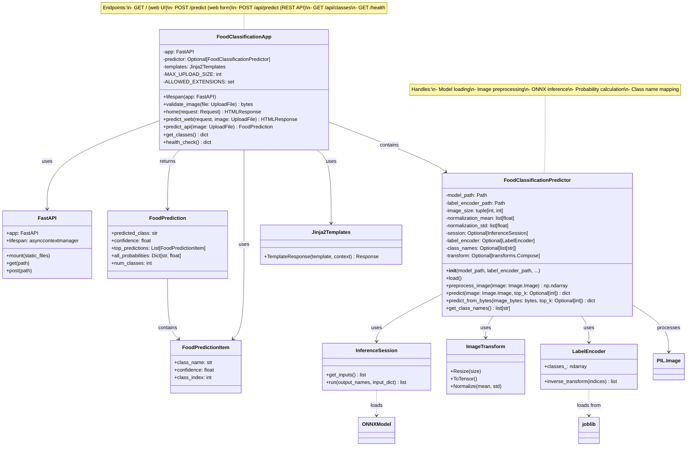

### Request/Response Flow

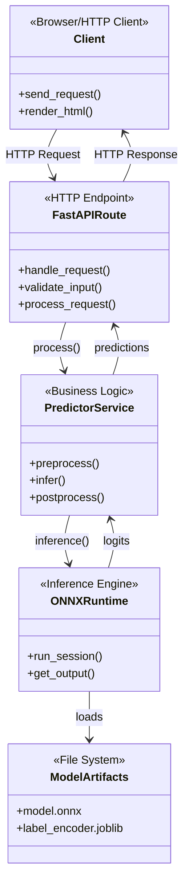

---

## Sequence Diagrams

### Web Interface Prediction Flow

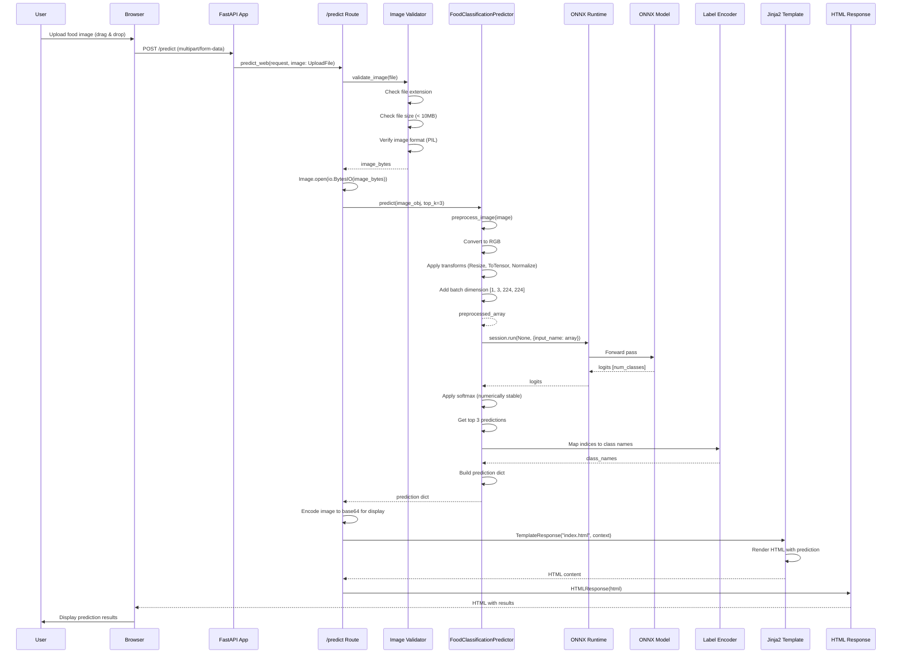

### REST API Prediction Flow

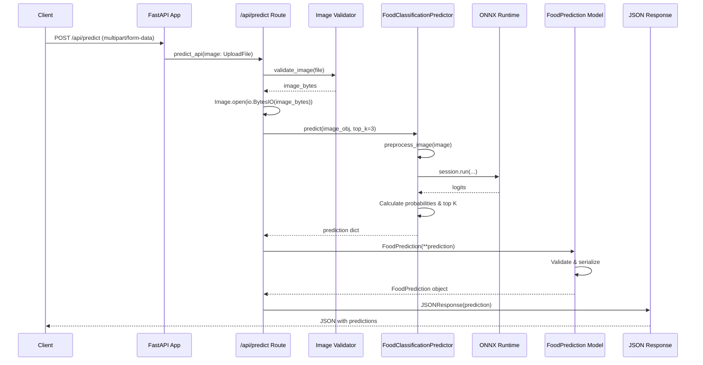

### Application Startup Sequence

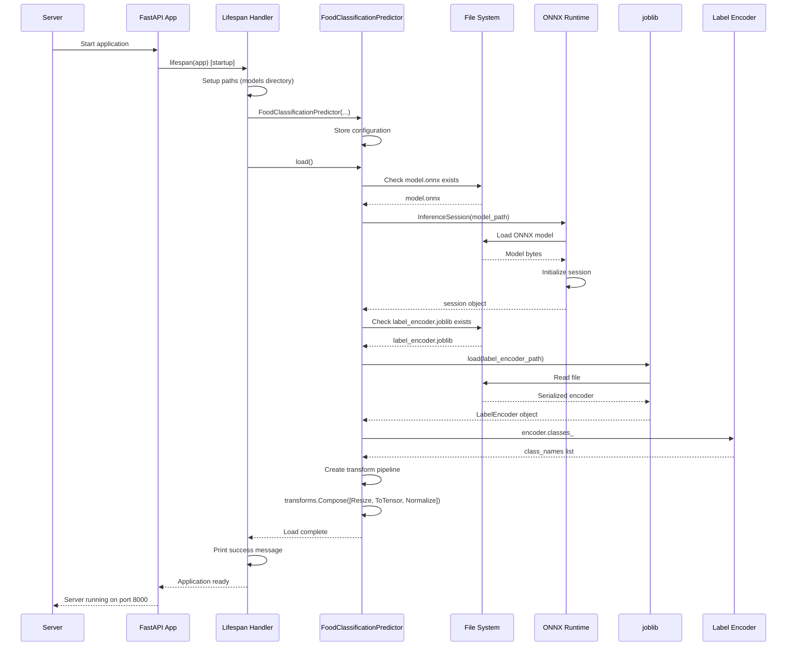

### Image Preprocessing Pipeline

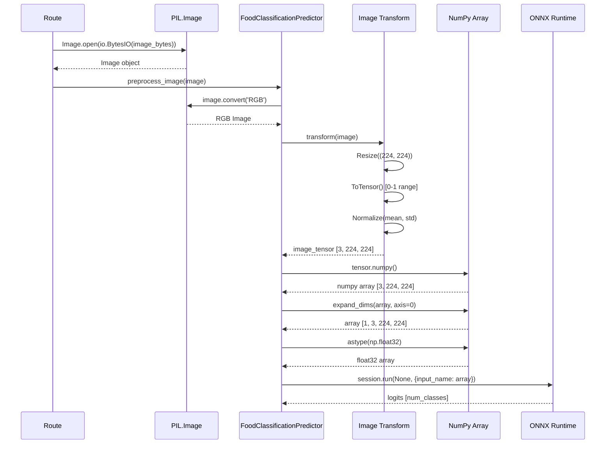

---

## Component Diagrams

### System Architecture

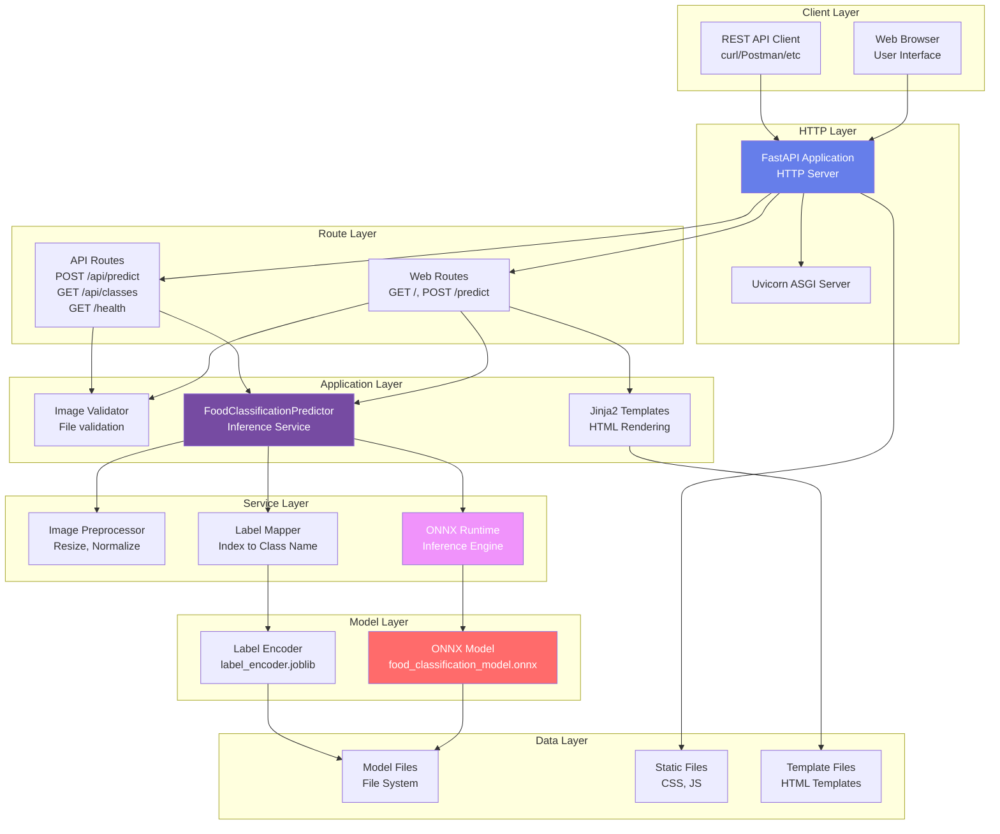

### Request Processing Pipeline

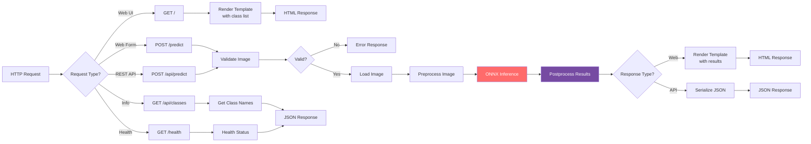

---

## Activity Diagrams

### Complete Prediction Workflow

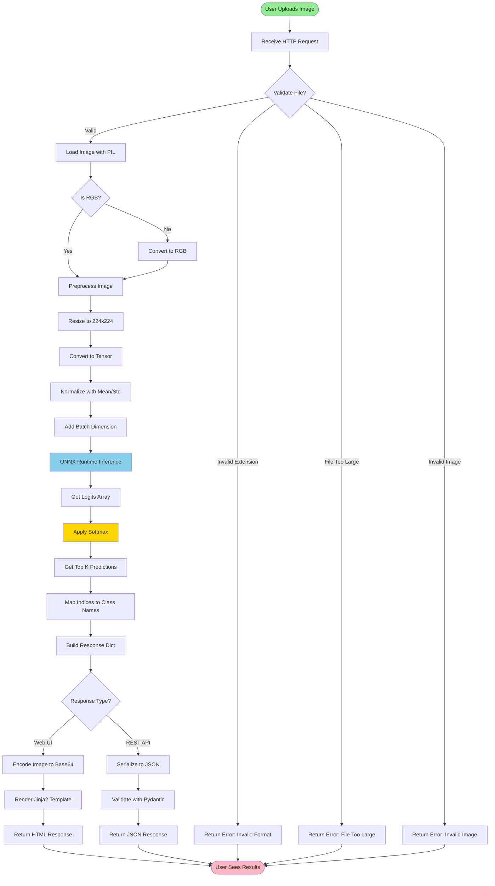

### Application Startup Workflow

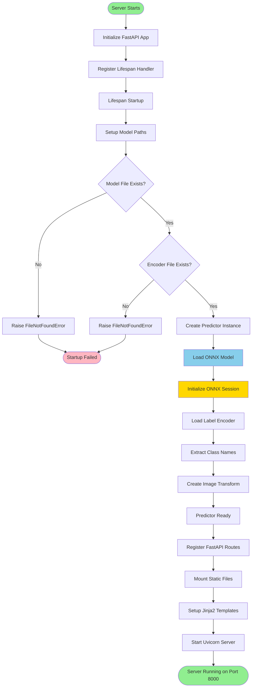

### Image Validation Workflow

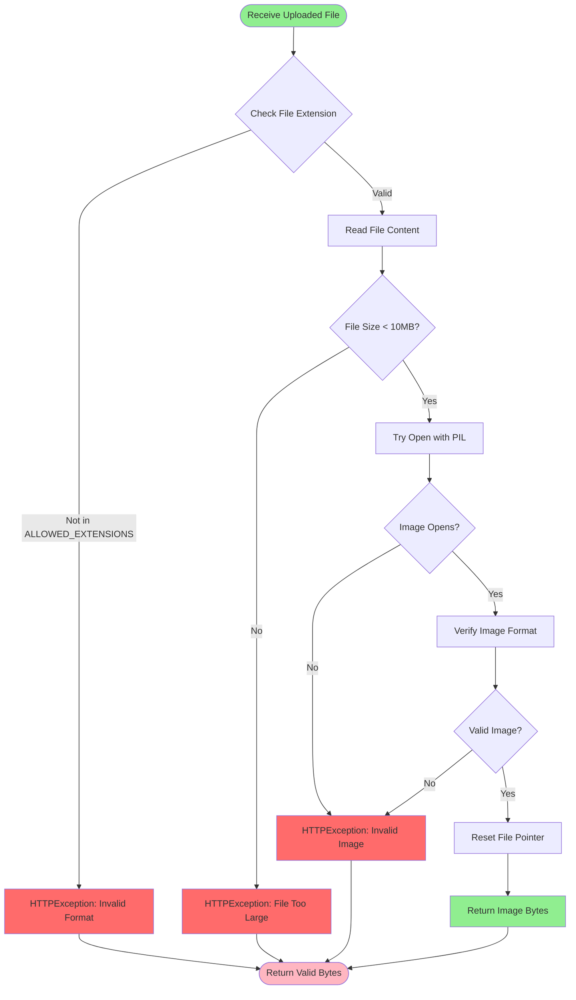

---

## Class-Level Details

### FoodClassificationApp (main.py)

**Purpose**: FastAPI application that serves the food classification web interface and REST API.

**Key Responsibilities**:
- Initialize FastAPI app with lifespan events
- Register HTTP routes (web UI and REST API)
- Handle image uploads and validation
- Coordinate between predictor and templates
- Serve static files and templates

**Key Attributes**:
- `app`: FastAPI application instance
- `predictor`: Global predictor instance (loaded at startup)
- `templates`: Jinja2 template engine
- `MAX_UPLOAD_SIZE`: Maximum file size (10MB)
- `ALLOWED_EXTENSIONS`: Allowed image formats

**Key Methods**:
- `lifespan()`: Startup/shutdown handler (loads model)
- `validate_image()`: Validates uploaded image file
- `home()`: Renders main page (GET /)
- `predict_web()`: Handles web form submission (POST /predict)
- `predict_api()`: REST API endpoint (POST /api/predict)
- `get_classes()`: Returns list of food classes (GET /api/classes)
- `health_check()`: Health check endpoint (GET /health)

**Endpoints**:
1. `GET /` - Web interface home page
2. `POST /predict` - Web form submission (returns HTML)
3. `POST /api/predict` - REST API (returns JSON)
4. `GET /api/classes` - List all food classes
5. `GET /health` - Health check

---

### FoodClassificationPredictor

**Purpose**: Service class that handles image preprocessing and ONNX model inference.

**Key Responsibilities**:
- Load ONNX model and label encoder at startup
- Preprocess images (resize, normalize, tensor conversion)
- Run ONNX inference
- Postprocess results (softmax, top-K selection, class mapping)
- Provide class name lookup

**Key Attributes**:
- `session`: ONNX Runtime InferenceSession
- `label_encoder`: sklearn LabelEncoder (loaded from joblib)
- `class_names`: List of food class names
- `transform`: torchvision transform pipeline
- `image_size`: Target image size (224, 224)
- `normalization_mean/std`: ImageNet normalization values

**Key Methods**:
- `load()`: Loads ONNX model and label encoder
- `preprocess_image()`: Converts PIL Image to ONNX-ready numpy array
- `predict()`: Main prediction method (returns dict with results)
- `predict_from_bytes()`: Convenience method for bytes input
- `get_class_names()`: Returns list of all class names

**Preprocessing Pipeline**:
1. Convert image to RGB (if needed)
2. Resize to (224, 224)
3. Convert to tensor (0-1 range)
4. Normalize with ImageNet mean/std
5. Add batch dimension [1, 3, 224, 224]
6. Convert to float32 numpy array

**Inference Pipeline**:
1. Get input name from ONNX session
2. Run session with preprocessed image
3. Get logits output
4. Apply softmax (numerically stable)
5. Get top-K predictions
6. Map indices to class names
7. Build response dictionary

---

### FoodPrediction (Pydantic Model)

**Purpose**: Response model for API validation and serialization.

**Key Fields**:
- `predicted_class`: Top predicted food class name
- `confidence`: Confidence score (0-1) for top prediction
- `top_predictions`: List of top K predictions (FoodPredictionItem)
- `all_probabilities`: Dictionary of all class probabilities
- `num_classes`: Total number of food classes

**Validation**: Automatically validates response structure and types.

---

### FoodPredictionItem (Pydantic Model)

**Purpose**: Single prediction item in top predictions list.

**Key Fields**:
- `class_name`: Food class name (aliased as `class`)
- `confidence`: Confidence score (0-1)
- `class_index`: Integer index of the class

---

## Data Flow Summary

### Request Flow

1. **Client** → HTTP Request (multipart/form-data with image)
2. **FastAPI** → Route handler receives request
3. **Validator** → Validates file (extension, size, format)
4. **Predictor** → Preprocesses image
5. **ONNX Runtime** → Runs inference on model
6. **Predictor** → Postprocesses results (softmax, top-K)
7. **Route** → Formats response (HTML or JSON)
8. **Client** ← HTTP Response with predictions

### Model Loading Flow

1. **Application Startup** → Lifespan handler triggered
2. **Predictor Creation** → Initialize with model paths
3. **ONNX Loading** → Load model.onnx into InferenceSession
4. **Encoder Loading** → Load label_encoder.joblib
5. **Class Extraction** → Get class names from encoder
6. **Transform Creation** → Create preprocessing pipeline
7. **Ready** → Predictor available for requests

---

## Key Design Patterns

1. **Singleton Pattern**: Global predictor instance (loaded once at startup)
2. **Service Layer Pattern**: Predictor encapsulates inference logic
3. **Template Method Pattern**: FastAPI defines request/response structure
4. **Factory Pattern**: Transform pipeline created from configuration
5. **Adapter Pattern**: Predictor adapts ONNX model to application needs

---

## Integration Points

### ONNX Model Integration

- **Model Format**: ONNX (Open Neural Network Exchange)
- **Runtime**: ONNX Runtime (ort.InferenceSession)
- **Input Shape**: [1, 3, 224, 224] (batch, channels, height, width)
- **Output Shape**: [num_classes] (logits)
- **Preprocessing**: Must match training preprocessing (resize, normalize)

### Label Encoder Integration

- **Format**: sklearn LabelEncoder saved with joblib
- **Purpose**: Maps class indices to class names
- **Loading**: Loaded at startup, used for all predictions
- **Dynamic**: Supports any number of classes (loaded from encoder)

### Web Interface Integration

- **Template Engine**: Jinja2
- **Static Files**: CSS, JavaScript (served via FastAPI static mount)
- **Image Display**: Base64-encoded images in HTML
- **Interactive**: Drag-and-drop upload, image preview, dynamic results

---

## Deployment Architecture

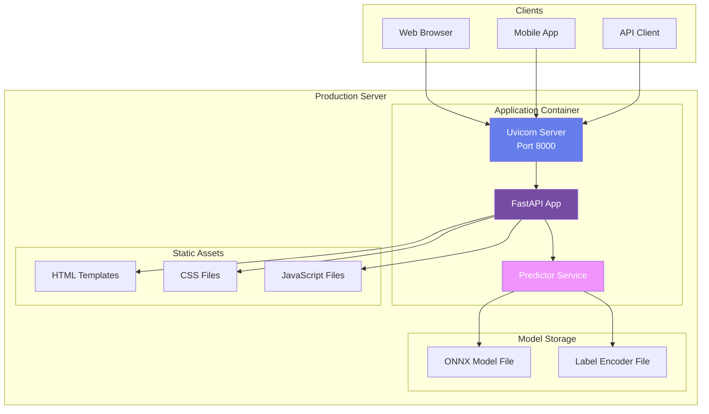

---

## Performance Considerations

1. **Model Loading**: Done once at startup (not per request)
2. **ONNX Runtime**: Optimized C++ backend for fast inference
3. **Image Preprocessing**: Efficient PIL and torchvision operations
4. **Batch Processing**: Single image per request (can be extended)
5. **Caching**: Predictor instance cached globally
6. **Async Support**: FastAPI async routes for concurrent requests

---

## Error Handling

1. **File Validation**: Extension, size, format checks
2. **Model Loading**: Startup validation with clear error messages
3. **Image Processing**: Graceful handling of corrupted images
4. **ONNX Inference**: Error handling for inference failures
5. **HTTP Errors**: Proper status codes (400, 500, 503)

---

*Last Updated: [Current Date]*
