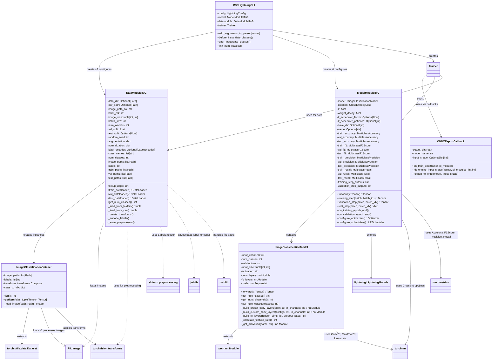
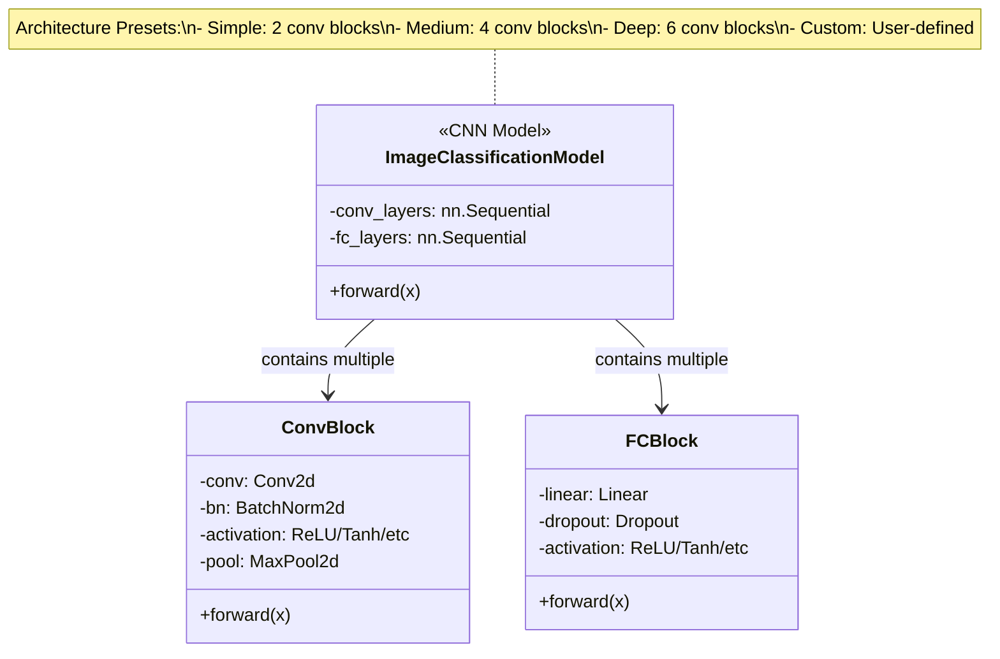
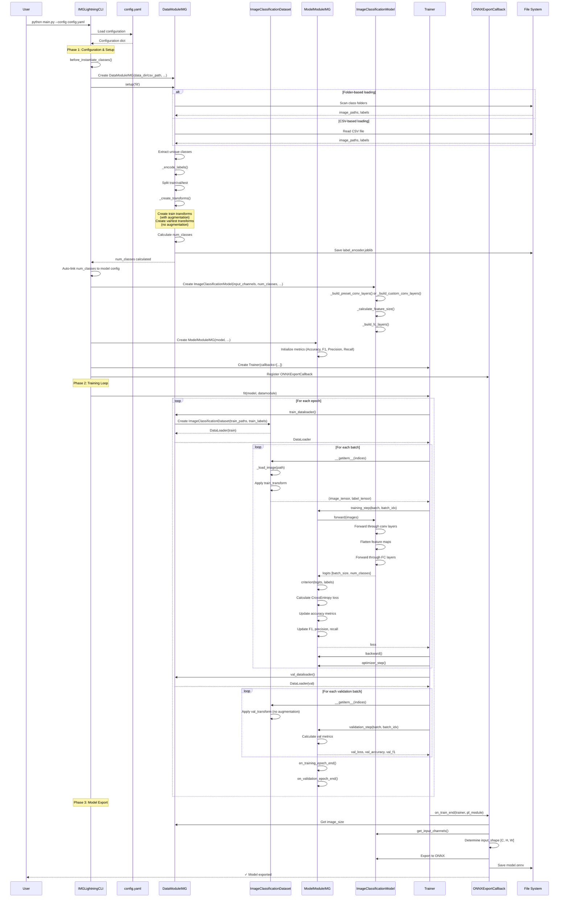
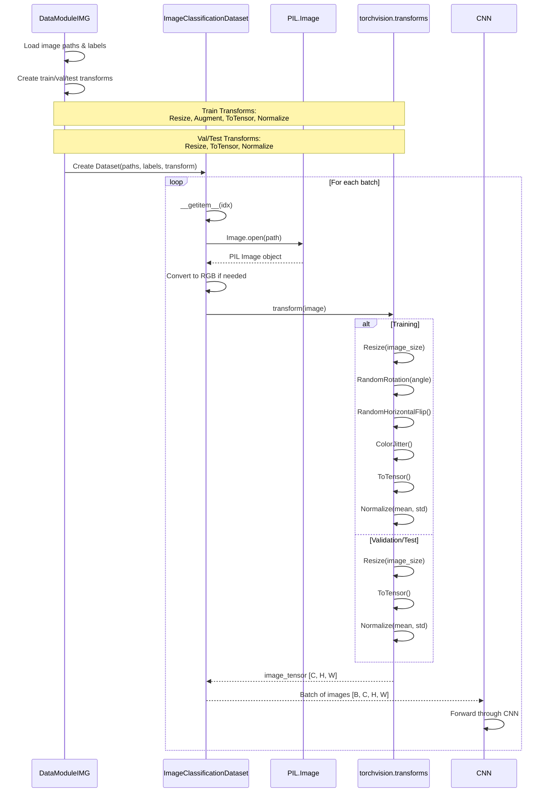
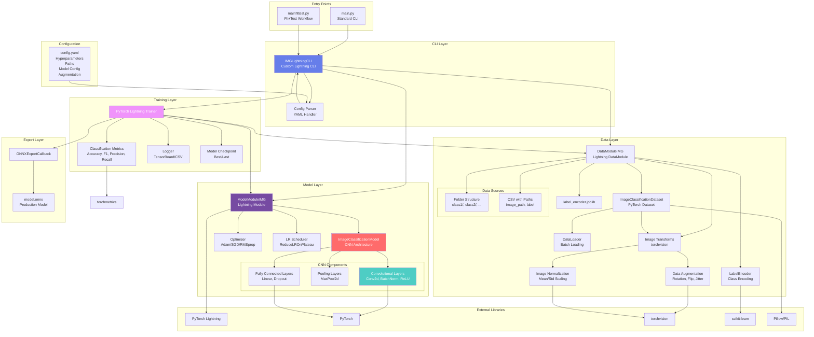
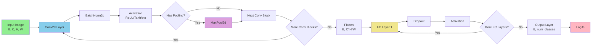

```mermaid
flowchart LR
    A[Raw Image File] --> B[PIL.Image.open]
    B --> C{Image Mode?}
    C -->|RGB| D[Use as-is]
    C -->|Grayscale| E[Convert to RGB]
    C -->|Other| E
    
    D --> F[Resize to image_size]
    E --> F
    
    F --> G{Is Training?}
    G -->|Yes| H[Data Augmentation]
    G -->|No| K[Skip Augmentation]
    
    H --> I[RandomRotation]
    I --> J[RandomHorizontalFlip]
    J --> L[ColorJitter]
    L --> M[RandomCrop]
    M --> K
    
    K --> N[ToTensor<br/>Convert to Tensor]
    N --> O[Normalize<br/>Mean/Std Scaling]
    O --> P[Final Image Tensor<br/>C, H, W]
    
    style A fill:#90EE90
    style P fill:#FFB6C1
    style H fill:#FFD700
    style N fill:#87CEEB
```

# Image Classification Module - UML Diagrams & Architecture Documentation

This document provides comprehensive UML diagrams and architectural documentation for the ImageClassification module, a reusable PyTorch Lightning pipeline for image classification tasks using CNNs.

## Table of Contents

1. [Architecture Overview](#architecture-overview)
2. [Class Diagrams](#class-diagrams)
3. [Sequence Diagrams](#sequence-diagrams)
4. [Component Diagrams](#component-diagrams)
5. [Activity Diagrams](#activity-diagrams)
6. [Class-Level Details](#class-level-details)

---

## Architecture Overview

The ImageClassification module is a generic, config-driven pipeline for training CNN-based image classification models. It differs significantly from tabular modules:

- **CNN Architecture**: Uses Convolutional Neural Networks instead of feedforward networks
- **Image Data**: Handles image files (JPG, PNG, etc.) instead of CSV tables
- **Image Preprocessing**: Resize, normalize, augment images
- **Data Organization**: Supports folder-based (class folders) or CSV-based (image paths + labels)
- **Transfer Learning Ready**: Architecture designed for easy extension to pretrained models

Key Components:
- **Data Layer**: Image loading, augmentation, transforms
- **Model Layer**: CNN with configurable architecture
- **Training Layer**: Standard PyTorch Lightning training with image-specific optimizations
- **Export Layer**: ONNX export for production deployment

---

## Class Diagrams

### Complete Class Diagram

### CNN Architecture Components

---

## Sequence Diagrams

### Training Workflow Sequence

### Image Loading & Preprocessing Sequence

---

## Component Diagrams

### System Architecture

### CNN Architecture Flow

---

## Activity Diagrams

### Image Classification Training Process

```mermaid
flowchart TD
    Start([Start Training]) --> LoadConfig[Load config.yaml]
    LoadConfig --> ParseConfig[Parse Configuration]
    ParseConfig --> CreateDM[Create DataModuleIMG]
    CreateDM --> SetupDM[Setup DataModule]
    
    SetupDM --> CheckData{Data Source?}
    CheckData -->|Folder| LoadFolders[Load from class folders<br/>Scan directory structure]
    CheckData -->|CSV| LoadCSV[Load from CSV<br/>Read image_path, label]
    
    LoadFolders --> ExtractClasses[Extract class names<br/>from folder names]
    LoadCSV --> ExtractClassesCSV[Extract class names<br/>from CSV labels]
    
    ExtractClasses --> EncodeLabels
    ExtractClassesCSV --> EncodeLabels[Encode labels with LabelEncoder]
    
    EncodeLabels --> GetClasses[Get num_classes & class_names]
    GetClasses --> SplitData{Split Data?}
    SplitData -->|Yes| TrainValTest[Split: Train/Val/Test]
    SplitData -->|No| TrainVal[Split: Train/Val]
    
    TrainValTest --> CreateTransforms[Create Image Transforms]
    TrainVal --> CreateTransforms
    
    CreateTransforms --> ConfigTrain[Train Transforms:<br/>Resize + Augmentation<br/>+ Normalize]
    ConfigTrain --> ConfigVal[Val/Test Transforms:<br/>Resize + Normalize<br/>No Augmentation]
    
    ConfigVal --> SaveLabelEnc{Save Label Encoder?}
    SaveLabelEnc -->|Yes| SaveLE[Save label_encoder.joblib]
    SaveLabelEnc -->|No| CreateModel
    
    SaveLE --> CreateModel[Create ImageClassificationModel]
    
    CreateModel --> CheckArch{Architecture?}
    CheckArch -->|Preset| BuildPreset[Build Preset Architecture<br/>simple/medium/deep]
    CheckArch -->|Custom| BuildCustom[Build Custom Architecture<br/>from config]
    
    BuildPreset --> CalcFeatureSize[Calculate Feature Map Size<br/>After Conv Layers]
    BuildCustom --> CalcFeatureSize
    
    CalcFeatureSize --> BuildFC[Build FC Layers]
    BuildFC --> LinkClasses[Auto-link num_classes]
    LinkClasses --> CreateModule[Create ModelModuleIMG]
    CreateModule --> InitMetrics[Initialize Metrics<br/>Accuracy, F1, Precision, Recall]
    InitMetrics --> CreateTrainer[Create Trainer]
    CreateTrainer --> AddCallbacks[Add Callbacks]
    
    AddCallbacks --> StartTraining[Start Training Loop]
    StartTraining --> Epoch{More Epochs?}
    
    Epoch -->|Yes| LoadBatch[Load Image Batch]
    LoadBatch --> LoadImages[Load Images from Disk<br/>PIL.Image.open]
    LoadImages --> ApplyTrainTransform[Apply Train Transform<br/>with Augmentation]
    ApplyTrainTransform --> ForwardPass[Forward Pass through CNN]
    
    ForwardPass --> ConvForward[Conv Layers Forward]
    ConvForward --> Flatten[Flatten Feature Maps]
    Flatten --> FCForward[FC Layers Forward]
    FCForward --> CalcLoss[Calculate CrossEntropy Loss]
    
    CalcLoss --> UpdateMetrics[Update Classification Metrics]
    UpdateMetrics --> Backward[Backward Pass]
    Backward --> UpdateWeights[Update Weights]
    UpdateWeights --> ValBatch{Validation?}
    
    ValBatch -->|Yes| LoadValImages[Load Val Images]
    LoadValImages --> ApplyValTransform[Apply Val Transform<br/>No Augmentation]
    ApplyValTransform --> ValForward[Validation Forward]
    ValForward --> ValMetrics[Calculate Val Metrics]
    ValMetrics --> LogMetrics[Log Metrics]
    LogMetrics --> Checkpoint{Save Checkpoint?}
    
    ValBatch -->|No| Checkpoint
    Checkpoint -->|Yes| SaveCheckpoint[Save Model]
    Checkpoint -->|No| Epoch
    SaveCheckpoint --> Epoch
    
    Epoch -->|No| ExportONNX[Export to ONNX<br/>with Image Input Shape]
    ExportONNX --> End([Training Complete])
    
    style Start fill:#90EE90
    style End fill:#FFB6C1
    style ExportONNX fill:#87CEEB
    style ConvForward fill:#FFD700
    style FCForward fill:#FFD700
    style ApplyTrainTransform fill:#DDA0DD
```

### Image Preprocessing Pipeline

---

## Class-Level Details

### IMGLightningCLI

**Purpose**: Custom CLI for image classification with auto-linking of `num_classes`.

**Key Responsibilities**:
- Parse YAML configuration
- Instantiate DataModule, Model, and Trainer
- Auto-link `num_classes` from DataModule to Model
- Handle image-specific configurations

**Key Methods**:
- `before_instantiate_classes()`: Auto-detects `num_classes` from DataModule
- `after_instantiate_classes()`: Fallback to set `num_classes` if needed

**Difference from Tabular Modules**: Links only `num_classes` (no `input_dim` needed - fixed by image size).

---

### DataModuleIMG

**Purpose**: Manages image data loading, preprocessing, and augmentation.

**Key Responsibilities**:
- Load images from folder structure or CSV
- Create train/val/test splits
- Define image transforms (with/without augmentation)
- Encode labels and save label encoder
- Auto-detect number of classes

**Key Attributes**:
- `data_dir`: Directory with class folders (optional)
- `csv_path`: CSV file with image paths (optional)
- `image_size`: Target image size (height, width)
- `augmentation`: Dictionary with augmentation settings
- `normalization`: Dictionary with normalization mean/std
- `label_encoder`: sklearn LabelEncoder for class names
- `num_classes`: Number of unique classes

**Key Methods**:
- `_load_from_folders()`: Loads images from class folders
- `_load_from_csv()`: Loads images from CSV file
- `_create_transforms()`: Creates train/val/test transforms
- `get_num_classes()`: Returns number of classes

**Data Organization**:
1. **Folder-based**: `data/images/class1/img1.jpg`, `data/images/class2/img2.jpg`
2. **CSV-based**: CSV with columns `image_path`, `label`

---

### ImageClassificationDataset

**Purpose**: PyTorch Dataset that loads and transforms images on-the-fly.

**Key Responsibilities**:
- Load images from disk (lazy loading)
- Apply transforms (resize, augment, normalize)
- Return (image_tensor, label_tensor) tuples

**Key Attributes**:
- `image_paths`: List of image file paths
- `labels`: List of encoded labels (integers)
- `transform`: torchvision.Compose transform pipeline
- `class_to_idx`: Dictionary mapping class names to indices

**Key Methods**:
- `_load_image(path)`: Loads and converts image to RGB
- `__getitem__(idx)`: Returns (image_tensor, label_tensor)

**Memory Efficiency**: Images loaded on-demand (not all in memory).

---

### ModelModuleIMG

**Purpose**: PyTorch Lightning module for image classification.

**Similar to ModelModuleCLS**: Uses same metrics and loss, but for images.

**Key Differences**:
- Works with image tensors [B, C, H, W] instead of feature vectors
- CNN model processes spatial data

---

### ImageClassificationModel

**Purpose**: Flexible CNN architecture for image classification.

**Key Responsibilities**:
- Define CNN architecture (conv + FC layers)
- Support preset architectures (simple, medium, deep)
- Support custom architectures
- Calculate feature map sizes automatically

**Key Attributes**:
- `input_channels`: 1 (grayscale) or 3 (RGB)
- `num_classes`: Number of output classes
- `architecture`: Preset name or 'custom'
- `conv_layers`: Sequential of conv blocks
- `fc_layers`: Sequential of fully connected layers

**Architecture Presets**:
1. **Simple**: 2 conv blocks (32, 64 channels)
2. **Medium**: 4 conv blocks (64, 128, 256, 512 channels)
3. **Deep**: 6 conv blocks (64, 128, 256, 256, 512, 512 channels)

**Key Methods**:
- `_build_preset_conv_layers()`: Builds preset architecture
- `_build_custom_conv_layers()`: Builds custom architecture
- `_calculate_feature_size()`: Calculates FC input size after conv layers
- `get_input_channels()`: Returns number of input channels

**Feature Size Calculation**: Automatically calculates feature map dimensions after all conv+pooling layers to determine FC input size.

---

### ONNXExportCallback

**Purpose**: Exports CNN model to ONNX with image input shape.

**Key Differences from Tabular**:
- Input shape is `[C, H, W]` (not `[features]`)
- Needs to determine image channels, height, width
- Example: `[3, 224, 224]` for RGB 224x224 images

**Key Methods**:
- `_determine_input_shape()`: Gets [C, H, W] from datamodule and model
- `_export_to_onnx()`: Exports with image input shape

---

## Key Design Patterns

1. **Template Method Pattern**: Lightning framework defines training loop
2. **Factory Pattern**: ModelFactory creates CNN architectures
3. **Strategy Pattern**: Configurable architectures, optimizers, augmentation
4. **Lazy Loading Pattern**: Images loaded on-demand in Dataset
5. **Adapter Pattern**: Transforms adapt raw images to tensor format

---

## Critical Implementation Details

### Image Preprocessing Pipeline

**Training Transforms**:
1. Resize to `image_size` (e.g., 224x224)
2. **Augmentation** (randomly applied):
   - Rotation (configurable angle)
   - Horizontal flip
   - Vertical flip (optional)
   - Color jitter (brightness, contrast, saturation, hue)
   - Random crop (optional)
3. Convert to tensor (0-1 range)
4. Normalize with mean/std (ImageNet defaults or custom)

**Validation/Test Transforms**:
1. Resize to `image_size`
2. Convert to tensor
3. Normalize with mean/std
4. **No augmentation** (deterministic)

### CNN Feature Size Calculation

The module automatically calculates feature map dimensions after conv layers:

1. Start with input size: `[H, W]` (e.g., 224x224)
2. For each conv block:
   - Apply conv (may change channels)
   - Apply pooling (reduces H, W by pooling factor)
3. Final feature size: `C × H' × W'`
4. FC input = flattened: `C × H' × W'`

This allows automatic FC layer sizing without manual calculation.

### Label Encoding

Similar to Classification module:
- Encodes string labels to integers
- Remaps non-0-indexed integers to 0-indexed
- Stores mapping for inverse transform (prediction → class name)

---

## Comparison: Tabular vs Image Modules

| Aspect | Regression/Classification | ImageClassification |
|--------|-------------------------|---------------------|
| **Input** | Tabular features (CSV) | Images (files) |
| **Model** | Feedforward NN | CNN |
| **Preprocessing** | sklearn (scaling, encoding) | torchvision (resize, normalize) |
| **Data Loading** | DataFrame → Tensor | Image files → Tensor |
| **Augmentation** | N/A | Rotation, flip, color jitter |
| **Input Shape** | `[batch, features]` | `[batch, channels, height, width]` |
| **Feature Extraction** | Direct from CSV | Learned by conv layers |

---

*Last Updated: [Current Date]*
