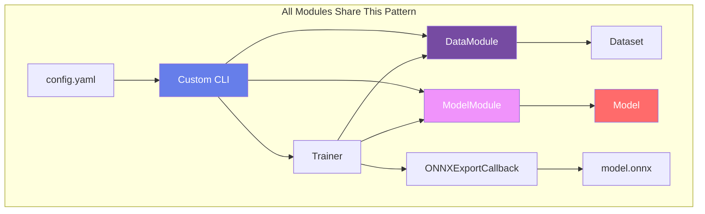
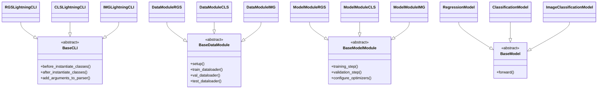
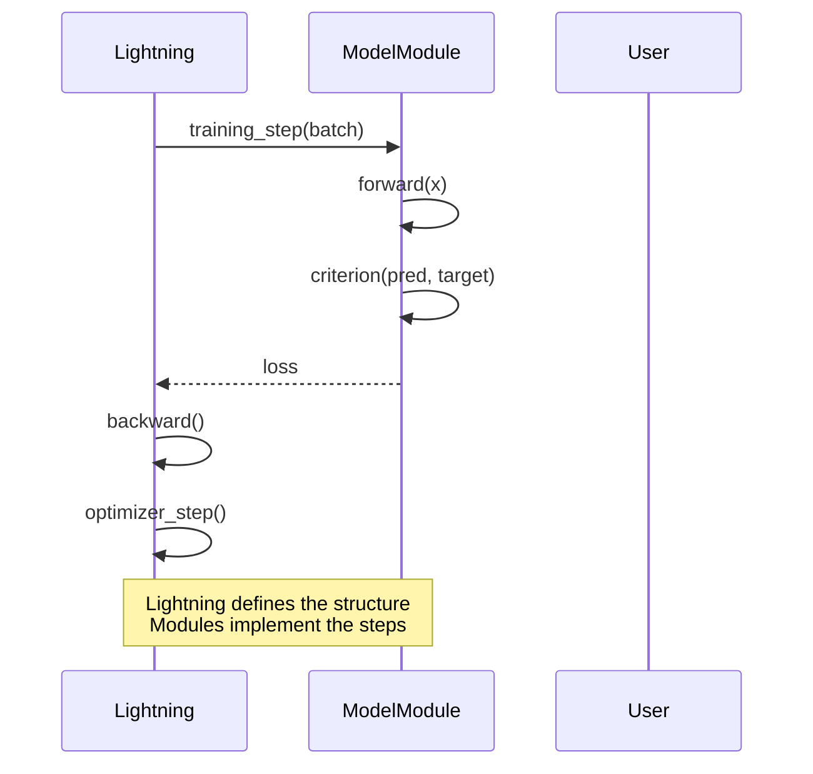
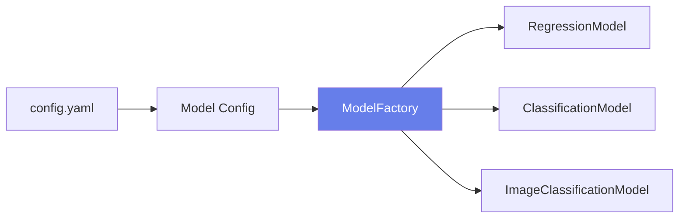
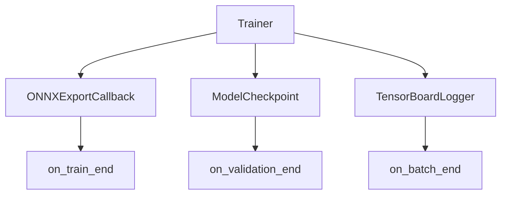
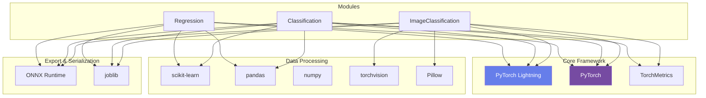
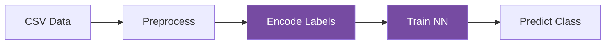
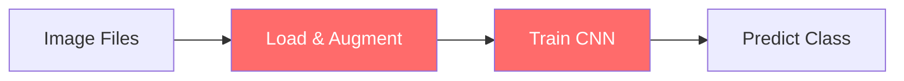
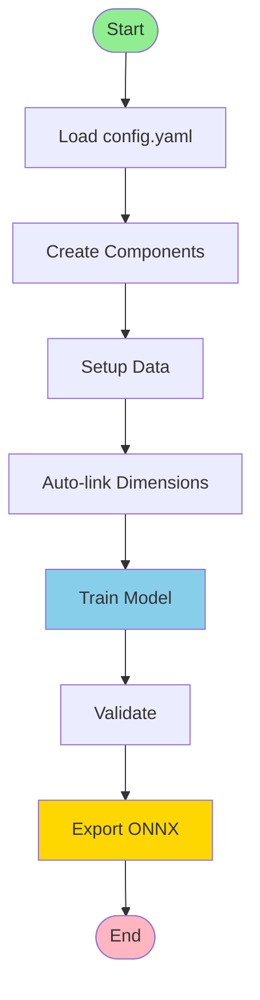

# AI Pipeline - Complete UML Documentation Overview

This document provides a high-level overview of the entire AI pipeline architecture, showing how the three reusable modules (Regression, Classification, ImageClassification) work together and share common design patterns.

## Table of Contents

1. [System Overview](#system-overview)
2. [Module Comparison](#module-comparison)
3. [Unified Architecture](#unified-architecture)
4. [Common Design Patterns](#common-design-patterns)
5. [Module Relationships](#module-relationships)
6. [Workflow Comparison](#workflow-comparison)

---

## System Overview

The AI pipeline consists of three independent, reusable modules that follow a consistent architecture pattern but are specialized for different tasks:

```
AI-Pipeline/
├── Regression/          # Tabular regression (e.g., price prediction)
├── Classification/      # Tabular classification (e.g., stress level)
└── ImageClassification/ # Image classification (e.g., food recognition)
```

All modules share:
- **PyTorch Lightning** framework
- **Config-driven** approach (YAML)
- **Modular architecture** (DataModule, ModelModule, ModelFactory)
- **ONNX export** for production
- **Auto-detection** of dimensions/classes

---

## Module Comparison

### High-Level Comparison

```mermaid
graph TB
    subgraph "Regression Module"
        R1[Tabular Data]
        R2[Feedforward NN]
        R3[MSELoss]
        R4[1 Output]
        R5[MSE, MAE, RMSE]
        R1 --> R2 --> R3 --> R4 --> R5
    end
    
    subgraph "Classification Module"
        C1[Tabular Data]
        C2[Feedforward NN]
        C3[CrossEntropyLoss]
        C4[N Classes Output]
        C5[Accuracy, F1, Precision, Recall]
        C1 --> C2 --> C3 --> C4 --> C5
    end
    
    subgraph "ImageClassification Module"
        I1[Image Files]
        I2[CNN]
        I3[CrossEntropyLoss]
        I4[N Classes Output]
        I5[Accuracy, F1, Precision, Recall]
        I1 --> I2 --> I3 --> I4 --> I5
    end
    
    style R2 fill:#667eea,color:#fff
    style C2 fill:#764ba2,color:#fff
    style I2 fill:#ff6b6b,color:#fff
```



### Detailed Feature Comparison

| Feature | Regression | Classification | ImageClassification |
|---------|-----------|---------------|---------------------|
| **Input Type** | CSV (tabular) | CSV (tabular) | Images (files) |
| **Data Organization** | CSV columns | CSV columns | Folder structure or CSV |
| **Model Type** | Feedforward NN | Feedforward NN | CNN |
| **Input Format** | Feature vector | Feature vector | Image tensor [C,H,W] |
| **Preprocessing** | sklearn (scaling, encoding) | sklearn (scaling, encoding) | torchvision (resize, augment) |
| **Output** | 1 continuous value | N class logits | N class logits |
| **Loss Function** | MSELoss | CrossEntropyLoss | CrossEntropyLoss |
| **Metrics** | MSE, MAE, RMSE | Accuracy, F1, Precision, Recall | Accuracy, F1, Precision, Recall |
| **Auto-Detection** | input_dim | input_dim, num_classes | num_classes |
| **Label Encoding** | N/A | Yes (to 0-indexed) | Yes (to 0-indexed) |
| **Augmentation** | N/A | N/A | Yes (rotation, flip, etc.) |

---

## Unified Architecture

### Common Architecture Pattern



### Shared Component Structure



---

## Common Design Patterns

### 1. Template Method Pattern

All modules use PyTorch Lightning's template method pattern:



### 2. Factory Pattern

Model factories create model instances from configuration:



### 3. Strategy Pattern

Configurable components use strategy pattern:

- **Optimizers**: Adam, SGD, RMSprop (configurable)
- **Schedulers**: ReduceLROnPlateau, OneCycleLR (configurable)
- **Activations**: ReLU, Tanh, GELU (configurable)
- **Architectures**: Simple, Medium, Deep (ImageClassification)

### 4. Observer Pattern

Callbacks observe training events:



---

## Module Relationships

### Shared Dependencies



---

## Workflow Comparison

### Regression Workflow


### Classification Workflow



### Image Classification Workflow



---

## Unified Training Flow

All modules follow the same high-level training flow:



---

## Module-Specific Details

### Regression Module
- **Focus**: Continuous value prediction
- **Key Feature**: Auto-detects `input_dim`
- **Use Case**: Price prediction, regression tasks
- **Documentation**: See `Regression/UML_DIAGRAMS.md`

### Classification Module
- **Focus**: Multi-class classification
- **Key Features**: 
  - Auto-detects `input_dim` and `num_classes`
  - Ensures 0-indexed labels for CrossEntropyLoss
- **Use Case**: Stress level prediction, categorical classification
- **Documentation**: See `Classification/UML_DIAGRAMS.md`

### Image Classification Module
- **Focus**: Image-based classification
- **Key Features**:
  - Supports folder-based or CSV-based data organization
  - Image augmentation for training
  - CNN architectures (simple, medium, deep, custom)
  - Auto-calculates feature map sizes
- **Use Case**: Food classification, image recognition
- **Documentation**: See `ImageClassification/UML_DIAGRAMS.md`

---

## How to Use This Documentation

1. **Start Here**: Read this overview to understand the overall architecture
2. **Module Details**: Dive into specific module documentation:
   - `Regression/UML_DIAGRAMS.md` - For regression tasks
   - `Classification/UML_DIAGRAMS.md` - For classification tasks
   - `ImageClassification/UML_DIAGRAMS.md` - For image classification
3. **Implementation**: Use the class diagrams and sequence diagrams to understand implementation details
4. **Extension**: Use the architecture patterns to extend or create new modules

---

## Key Takeaways

1. **Consistency**: All modules follow the same architectural pattern
2. **Modularity**: Each module is independent and reusable
3. **Config-Driven**: Everything configured via YAML files
4. **Auto-Detection**: Automatic dimension/class detection reduces errors
5. **Production-Ready**: ONNX export for all modules
6. **Extensibility**: Easy to add new modules following the same pattern

---

## Next Steps

- Explore individual module documentation for detailed UML diagrams
- Review example configurations in project directories
- See README files for usage instructions
- Check example projects (GemstonePricePrediction, StressLevelPrediction, FoodClassification)

---

*Last Updated: [Current Date]*
*For detailed module documentation, see individual UML_DIAGRAMS.md files in each module directory.*
